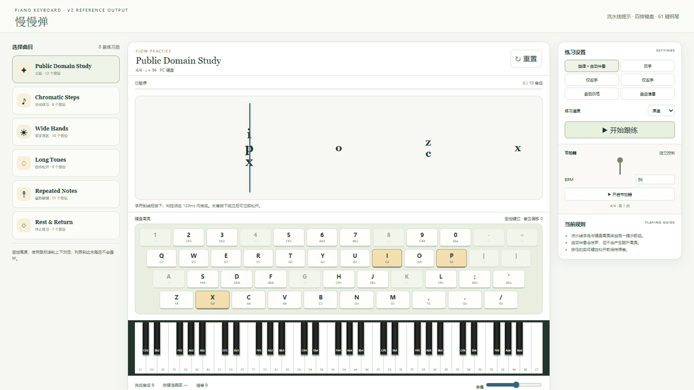

<p align="center">
  
</p>

<p align="center"><strong>Turn a piano score into a playable, testable, fully offline keyboard-practice app.</strong></p>

<p align="center">
  <a href="README.md">简体中文</a> ·
  <a href="README.en.md"><strong>English</strong></a>
</p>

<p align="center">
  
  
  
  
</p>

<p align="center">
  <a href="#start-with-one-command">Quick start</a> &nbsp;·&nbsp;
  <a href="#see-it-in-action">Demo</a> &nbsp;·&nbsp;
  <a href="#install-and-update">Install &amp; update</a> &nbsp;·&nbsp;
  <a href="#development-and-validation">Development</a>
</p>

---

## Start with one command

```bash
npx skills add gyh2004-hans/piano-keyboard
```

Give your Agent a score image or PDF and invoke `$piano-keyboard`. One workflow takes you from confirmed notation and key mapping to an offline app with browser acceptance checks.

> [!TIP]
> Already installed? Run `npx skills update piano-keyboard` to get the latest repository version.

## See it in action

<p align="center">
  
</p>

<p align="center"><sub>Recorded from the real reference app: demonstration mode, note-flow progress, canonical key prompts, pause, and resume.</sub></p>

## What it solves

| Capability | What you get |
|:---|:---|
| **Score confirmation** | Complete page inventory, hands and rhythm, uncertainty review |
| **Key mapping** | A fixed 35-key chromatic layout with automatic hand banks |
| **Offline practice** | Note flow, four-row key highlights, 61-key piano, accompaniment |
| **Verified delivery** | Data validation, mapping analysis, state-machine and browser checks |

The output is a local HTML/CSS/JavaScript and Web Audio application with no runtime network dependency. This repository contains an Agent Skill, specifications, tools, tests, and a public-domain reference app. It is not a standalone OCR service and does not bundle commercial scores.

## Optional 3D Piano module

When a performance view is wanted, add a 3D piano to the existing offline practice app while preserving 2D practice progress. It reuses the main page's 35-key mapping and offers 61 playable keys, ivory and obsidian finishes, and a brown stage with ambient lighting off by default. Each key has a rainbow note trail, from red on the left to violet on the right; the trail grows with hold time, then rises straight upward and fades after release. See the [3D Piano extension specification](references/3d-piano.md) for implementation and acceptance details.

## Install and update

### General usage

| Scenario | Command |
|---|---|
| Install | `npx skills add gyh2004-hans/piano-keyboard` |
| Update the current installation | `npx skills update piano-keyboard` |
| Update a project-scoped installation | `npx skills update piano-keyboard -p -y` |
| Update a global installation | `npx skills update piano-keyboard -g -y` |

`-p` selects project scope, `-g` selects global scope, and `-y` skips interactive confirmation. `skills update` applies to Skills installed and tracked by the Skills CLI. See the [Skills CLI documentation](https://skills.sh/docs/cli) for the complete command contract.

### Codex on Windows

To make the Skill globally available in Codex while copying files instead of requiring symbolic-link privileges:

```bash
npx skills add gyh2004-hans/piano-keyboard --skill piano-keyboard --agent codex --global --copy --yes
```

Use the global update command afterward:

```bash
npx skills update piano-keyboard -g -y
```

## Recommended prompt

```text
$piano-keyboard Read every attached score page and collect uncertain notation for confirmation.
After confirmation, build an offline PC practice app with the 35-key chromatic mapping and
automatic octave banks. Stack the flow lane, four-row keyboard, and 61-key piano in the center;
preserve chords, long notes, automatic accompaniment, speed controls, and statistics.
Run data, mapping, and real-browser acceptance checks, then report any remaining limitations.
```

## From score to deliverable

**01 Confirm → 02 Model → 03 Map → 04 Build → 05 Verify**

| Stage | Delivery requirement |
|---|---|
| Recognition | Skip no pages, guess no unclear notation, and preserve source and uncertainty records |
| Data | Normalize a copy without mutating the original score data |
| Mapping | Report shared/dual banks, held-key locks, supplemental keys, and blocked groups |
| Implementation | Local assets, Web Audio, copyable output, and no runtime CDN |
| Acceptance | Evidence for data, mapping, state machine, desktop layout, audio, and critical interactions |

## Version 2 behavior contract

35 computer keys cover consecutive semitones; a 61-key piano preserves the playing view. Wide groups can use independent octave banks for each hand.

<details>
<summary><strong>Expand the key layout and mapping rules</strong></summary>


Render the complete four-row physical keyboard:

```text
1 2 3 4 5 6 7 8 9 0 - =
 Q W E R T Y U I O P [ ]
  A S D F G H J K L ; '
   Z X C V B N M , . /
```

The standard chromatic sequence is:

```text
Q 2 W 3 E R 5 T 6 Y 7 U I 9 O 0 P Z S X D C F V B H N J M , L . ; / '
```

- The 35 standard keys cover MIDI 48–82 before octave shifting.
- Prefer one shared octave bank; use independent hand banks only when needed.
- A physically held key keeps its pitch while the mapping changes.
- `A G K 1 4 8` are supplemental bindings used only when the standard layout cannot cover a group, and they must be reported.
- Never silently transpose, delete, or rewrite source events to make mapping easier.

See the [key-mapping specification](references/keyboard-mapping.md) for the algorithm and worked examples.

</details>

### One prompt source, three exact views

The current flow-character array is the only visible target set. Flow letters, middle-keyboard highlights, and the keys required from the player must match character for character.

Automatic accompaniment may remain audible without adding highlights. Sustained notes from a previously accepted group must not leak into the next prompt. See [prompt consistency](references/prompt-consistency.md) for regression patterns and DOM-set assertions.

### Practice judgment

| Behavior | Rule |
|---|---|
| Chords | Complete all correct onsets within an inclusive **120ms** window that starts on the first correct onset |
| Wrong notes | Sound normally and count as attempts and mistakes, but never advance the group |
| Long notes | Onset-only judgment; release immediately after acceptance without penalty, waiting, or score-clock freeze |
| Repeated notes | Release the key before pressing it again |

See the [practice-engine specification](references/practice-engine.md) for complete transitions.

## Layout and preserved capabilities

The primary target is a 2560×1440, 16:9 desktop browser. The left rail is a fixed-height, non-looping library showing six complete songs at a time. The center stacks the flow lane, four-row computer keyboard, and 61-key piano. Practice settings stay on the right.

When repairing or extending an existing app, preserve its library, original-score view, hand selection, automatic accompaniment, demonstration, free play, measure range, speed, pause, reset, looping, volume, and statistics.

## Development and validation

Requires Node.js 20+, PowerShell, and an available Playwright browser.

<details>
<summary><strong>Expand development, testing, and data-validation commands</strong></summary>


```powershell
npm ci
npm run validate
npm run test:browser -- --reporter=line
powershell -ExecutionPolicy Bypass -File scripts/package_skill.ps1
```

Run individual data and output checks with:

```powershell
node scripts/validate_score.mjs path/to/score.json
node scripts/normalize_score.mjs path/to/score.json path/to/normalized.json
node scripts/analyze_mapping.mjs path/to/normalized.json
node scripts/validate_project.mjs path/to/generated-app
```

The public-domain/synthetic reference app lives in [examples/generated-app](examples/generated-app). Use it to inspect behavior and run acceptance checks; do not copy it wholesale into a user project.

</details>

## Documentation and repository map

| Path | Purpose |
|---|---|
| [SKILL.md](SKILL.md) | Agent routing, execution order, and mandatory product invariants |
| [references/](references/) | Recognition, mapping, state machine, prompt, UI, audio, and acceptance details |
| [schemas/](schemas/) | Score JSON Schema |
| [scripts/](scripts/) | Validation, normalization, mapping analysis, packaging, and local-install tools |
| [tests/](tests/) | Unit and real-browser tests |

## Scope and license

Desktop browsers are the primary scope. The 390px check proves only that there is no page-level horizontal overflow; it is not a claim of complete mobile-performance support. Users are responsible for confirming the right to process and distribute source scores.

Code and documentation use the [MIT License](LICENSE). It grants no rights to third-party songs or scores.

---

<p align="center"><sub>Bring the score. Follow the flow. Play it.</sub><br>
<a href="#start-with-one-command">Get started</a> · <a href="LICENSE">MIT License</a></p>
