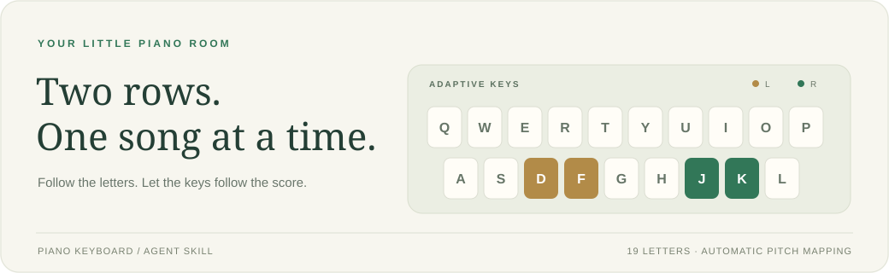

<p align="center"></p>

<h1 align="center">Piano Keyboard</h1>
<p align="center"><strong>Bring a score. Follow the flow. Play it on a computer keyboard.</strong></p>
<p align="center">Agent Skill · fixed 35-key chromatic layout · automatic octave banks · offline desktop app</p>

<p align="center"><a href="README.md">简体中文</a> · <strong>English</strong></p>

---

## What it does

`piano-keyboard` guides an Agent from piano-score images, PDFs, or structured data to an offline practice app. Version 2 uses a fixed 35-key chromatic layout with automatic shared or independent left/right octave banks. The center view keeps a moving character flow, computer-key highlights, and a 61-key piano synchronized.

The repository contains Agent instructions, a score schema, executable mapping/practice models, a public reference app, and automated acceptance tests. It is not a standalone OCR service and does not bundle commercial scores.

## Install

```bash
npx skills add gyh2004-hans/piano-keyboard
```

For a copied global Codex installation on Windows:

```bash
npx skills add gyh2004-hans/piano-keyboard --skill piano-keyboard --agent codex --global --copy --yes
```

Example request:

```text
$piano-keyboard Read every attached score page and collect uncertain notation for confirmation.
Then build an offline PC practice app with the 35-key chromatic mapping and automatic octave
banks. Stack the flow lane, four-row keyboard, and 61-key piano in the center, and preserve
chords, long notes, accompaniment, speed controls, and statistics.
```

## Version 2 contract

Render the four physical rows:

```text
1 2 3 4 5 6 7 8 9 0 - =
 Q W E R T Y U I O P [ ]
  A S D F G H J K L ; '
   Z X C V B N M , . /
```

The standard chromatic sequence is:

```text
Q 2 W 3 E R 5 T 6 Y 7 U I 9 O 0 P Z S X D C F V B H N J M , L . ; / '
```

- The 35 standard keys cover MIDI 48–82 before octave shifting.
- Prefer one shared octave bank; use independent hand banks only when needed.
- A physically held code keeps its pitch until release.
- `A G K 1 4 8` are reported supplemental bindings, never silent substitutions.
- Never delete, transpose, or rewrite source events to make mapping easier.

## One visible prompt source

The current flow-character array is the only source for keyboard target classes. Practice `.target` and demonstration `.demo-note` sets must exactly equal the current flow set.

Automatic accompaniment remains audible without adding highlights. Previously accepted sustained notes must not leak into the next prompt. See [prompt consistency](references/prompt-consistency.md) for the regression patterns and DOM-set checks.

## Timing rules

- Complete chords within an inclusive **120ms** onset window.
- Wrong notes sound and count, but never satisfy the onset.
- Long notes are onset-only: release immediately after acceptance with no penalty, waiting, or score-clock freeze.
- Repeated notes require release and re-press.

## Layout and preserved scope

The primary target is 2560×1440 at 16:9. The left rail shows six complete non-looping song cards. The center stacks flow → four-row keyboard → 61-key piano. Settings live on the right.

When repairing an existing app, preserve its library, original-score view, hand selection, measure range, speed, pause/reset, looping, statistics, demonstration, free play, accompaniment, volume, and independent metronome.

## Development and validation

Requires Node.js 20+, PowerShell, and a Playwright browser:

```powershell
npm ci
npm run validate
npm run test:browser -- --reporter=line
python C:/Users/24939/.codex/skills/.system/skill-creator/scripts/quick_validate.py .
powershell -ExecutionPolicy Bypass -File scripts/package_skill.ps1
```

Data and output checks:

```powershell
node scripts/validate_score.mjs path/to/score.json
node scripts/normalize_score.mjs path/to/score.json path/to/normalized.json
node scripts/analyze_mapping.mjs path/to/normalized.json
node scripts/validate_project.mjs path/to/generated-app
```

The synthetic/public-domain reference lives in [examples/generated-app](examples/generated-app). Inspect its behavior and selectors; do not copy it wholesale.

## Repository map

| Path | Purpose |
|---|---|
| [SKILL.md](SKILL.md) | Agent routing and mandatory invariants |
| [references/](references/) | Recognition, mapping, state machine, prompt, UI, audio, and acceptance details |
| [schemas/](schemas/) | Score JSON schema |
| [scripts/](scripts/) | Validation, normalization, analysis, packaging, and local installation |
| [tests/](tests/) | Unit and real-browser tests |

## Scope and license

Desktop browsers are the primary scope. A 390px no-overflow check is not a claim of full mobile performance support. Users must confirm rights to process and distribute source scores.

Code and documentation use the [MIT License](LICENSE), which grants no rights to third-party songs or scores.
